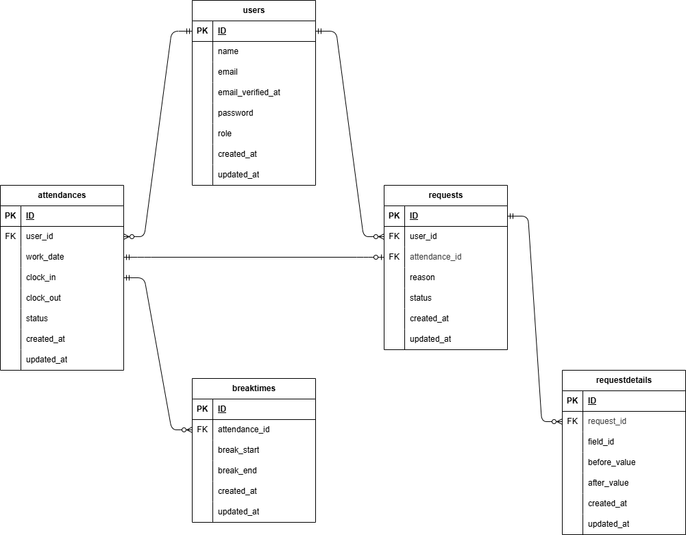

## アプリケーション名

JS_practice

## 環境構築

リポジトリからダウンロード

```
git clone https://github.com/sazenshinji/prac-01-js.git
```

「.env.example」をコピーして「.env」を作成

```
cp .env.example .env
```

docker コンテナを構築

```
docker-compose up -d --build
```

php コンテナにログインして Laravel をインストール

```
docker-compose exec php bash
composer install
```

アプリケーションキーを作成

```
php artisan key:generate
```

DB の設定を変更

.env ファイルを以下の様に修正します。

```
DB_CONNECTION=mysql
DB_HOST=mysql
DB_PORT=3306
DB_DATABASE=laravel_db
DB_USERNAME=laravel_user
DB_PASSWORD=laravel_pass
```

DB のテーブルを作成

```
php artisan migrate:fresh
php artisan db:seed
```

"The stream or file could not be opened"エラーが発生した場合

src ディレクトリにある storage ディレクトリに権限を設定

```
chmod -R 777 storage
```

=================================================================================

## テーブルダミーデータについて

## 管理者は以下の 2 名

    name ： '長嶋 茂雄',

    email ： '1234@abcd5',

    password ： '12345678',

    name ： '澤 穂希',

    email ： '1234@abcd6',

    password ： 12345678',

## 一般ユーザーは以下の 4 名

    name ： '大谷 翔平',

    email ： '1234@abcd1',

    password ： '12345678',

    name ： '八村 塁',

    email ： '1234@abcd2',

    password ： '12345678',

    name ： '石川 佳純',

    email ： '1234@abcd3',

    password ： '12345678',

    name ： '渋野 日向子',

    email ： '1234@abcd4',

    password ： '12345678',

## 勤怠データーを登録している日

    大谷 翔平：11月4日(火),11月5日(水),11月6日(木),11月7日(金),

            11月10日(月),11月11日(火),11月12日(水),11月13日(木),11月14日(金),

            11月17日(月),11月18日(火),11月19日(水),11月20日(木),11月21日(金),

            11月25日(火),11月26日(水),11月27日(木),11月28日(金),

            12月1日(月),12月2日(火),12月3日(水),12月4日(木),12月5日(金)

    八村 塁：11月25日(火),11月26日(水),11月27日(木),11月28日(金),

            12月1日(月),12月2日(火),12月3日(水),12月4日(木),12月5日(金)

    石川 佳純：11月25日(火),11月26日(水),11月27日(木),11月28日(金),

            12月1日(月),12月2日(火),12月3日(水),12月4日(木),12月5日(金)

    渋野 日向子：11月25日(火),11月26日(水),11月27日(木),11月28日(金),

             12月1日(月),12月2日(火),12月3日(水)

## 修正申請中、承認済みの日

    大谷 翔平：11月5日(水),11月8日(土),12月1日(月),12月2日(火)

    八村 塁：11月28日(金)

    石川 佳純：11月30日(日)

    渋野 日向子：12月1日(月)

=================================================================================

# 機能追加について

    クライアント(今回はコーチがクライアント役)と協議、承諾の上、以下の機能を追加しています。

## 追加する機能

    ・登録済みの勤怠情報の「削除」と 未入力の勤怠情報の「追加」機能。

## 機能の追加 に伴う機能要件・画面の変更

    １．入力済の勤怠の詳細画面に[削除]ボタンを追加します。

    ２．勤怠詳細画面のメッセージ変更。

        変更前：「＊ 承認待ちのため修正はできません。」

        変更後(修正)：「＊「修正」承認待ちのため修正はできません。」

        変更後(追加)：「＊「追加」承認待ちのため修正はできません。」

        変更後(削除)：「＊「削除」承認待ちのため修正はできません。」

    ３．画面パスの変更

        変更理由：「追加」機能により、未登録の日付、ユーザーの 勤怠詳細画面の表示が必要になるため。

        変更内容：

            ・勤怠詳細画面（一般ユーザー）：

                変更前： /attendance/detail/{id}

                変更後： /attendance/detail/{date}

            ・勤怠詳細画面（管理者）：

                変更前：admin/attendance/{id}

                変更前：admin/attendance/{user}/{date}

=================================================================================

# 機能要件の詳細

    以下は 詳細が未定義のため、クライアントに確認の上 以下の様に実装しています。

    １． 勤怠詳細の表示と修正の対象日：

        ・勤怠詳細の表示：当日まで表示。翌日以降の[詳細]ボタンはグレー表示。

        ・勤怠詳細の修正：昨日以前が対象。当日の詳細画面は表示のみで[修正][削除]ボタンはグレー表示。

    ２．勤怠詳細の"休憩"ラベルの表示：

        ・休憩入力がある日：既存休憩を"休憩"、追加休憩を"休憩２"とする。

        ・休憩入力が無い日：追加休憩を"休憩１"とする。

=================================================================================

# 「PHPUnit による単体テスト」について

## １．準備

1.1 テスト用のデータベースの準備

・MySQL コンテナに入る。

bash

cd coachtech/shigeno-sp2b-kintai/

docker-compose exec mysql bash

・root ユーザ(管理者)でログイン。

bash

mysql -u root -p

root

・「fleama_test」というデータベースを作成する。

bash

CREATE DATABASE fleama_test;

・mysql、MySQL コンテナから抜ける。

bash

exit

exit

1.2 src/config/database.php ファイルの変更

（★ 編集済のため作業不要です。）

1.3 テスト用の.env ファイル作成

・PHP コンテナにログインし、.env をコピーして.env.testing というファイルを作成

PHP コンテナ

bash

cp .env .env.testing

・PHP コンテナから抜け、コピーしたファイルの権限変更

exit

sudo chmod -R 777 \*

(パスワードを入力)

・.env.testing ファイルを以下の様に編集する

「文頭部分の APP_ENV と APP_KEY」の変更

---

APP_NAME=Laravel

- APP_ENV=local

- APP_KEY=

* APP_ENV=test

* APP_KEY=

APP_DEBUG=true

APP_URL=http://localhost

---

「データベースの接続情報」の変更

---

- DB_CONNECTION=mysql

* DB_CONNECTION=mysql_test

DB_HOST=mysql

DB_PORT=3306

- DB_DATABASE=laravel_db

- DB_USERNAME=laravel_user

- DB_PASSWORD=laravel_pass

* DB_DATABASE=fleama_test

* DB_USERNAME=root

* DB_PASSWORD=root

---

・PHP コンテナに入り、APP_KEY に新たなテスト用のアプリケーションキーを加える

bash

php artisan key:generate --env=testing

1.4 キャッシュの削除とテスト用のテーブルの作成

・キャッシュの削除を行う

bash

php artisan config:clear

・テスト用のテーブルの作成を行う

bash

php artisan migrate --seed --env=testing

1.5 PHPUnit の設定ファイル「phpunit.xml」の編集

（★ 編集済のため作業不要です。）

## ２．テストの実行

・すべてのテストを実行

bash

php artisan test

・特定のテストを実行

bash

php artisan test --filter=(Feature テストファイル名)

=================================================================================

## 使用技術(実行環境)

PHP 7.4.9 (cli) (built: Sep 1 2020 02:33:08) ( NTS )

Laravel Framework 8.83.8

mysql Ver 8.0.26 for Linux on x86_64 (MySQL Community Server - GPL)

nginx version: nginx/1.21.1

jquery：v3

## URL

開発環境：http://localhost/

phpMyAdmin：http://localhost:8080/

会員登録画面（一般ユーザー）： /register

メール認証誘導画面： /email/verify

ログイン画面（一般ユーザー）： /login

勤怠登録画面（一般ユーザー）： /attendance

勤怠一覧画面（一般ユーザー）： /attendance/list

勤怠詳細画面（一般ユーザー）： /attendance/detail/{date}

申請一覧画面（ユーザー）： /stamp_correction_request/list

ログイン画面（管理者）： /admin/login

勤怠一覧画面（管理者）： /admin/attendance/list

勤怠詳細画面（管理者）： /admin/attendance/{user}/{date}

スタッフ一覧画面（管理者）： /admin/staff/list

スタッフ別勤怠一覧画面（管理者）： /admin/attendance/staff/{id}

申請一覧画面（管理者）： /stamp_correction_request/list

修正申請承認画面(承認待ち)： /stamp_correction_request/approve/{id}

修正申請承認画面(承認済み)： /stamp_correction_request/approve/{id}?tab=approved

## ER 図


